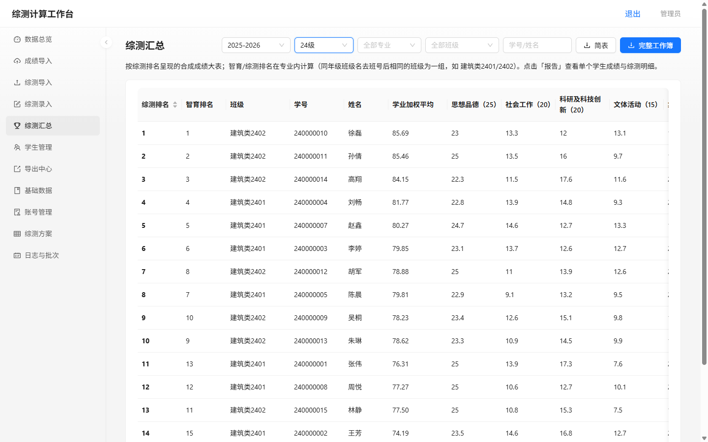
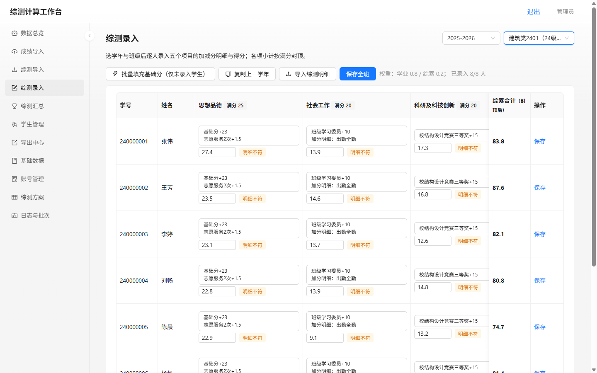
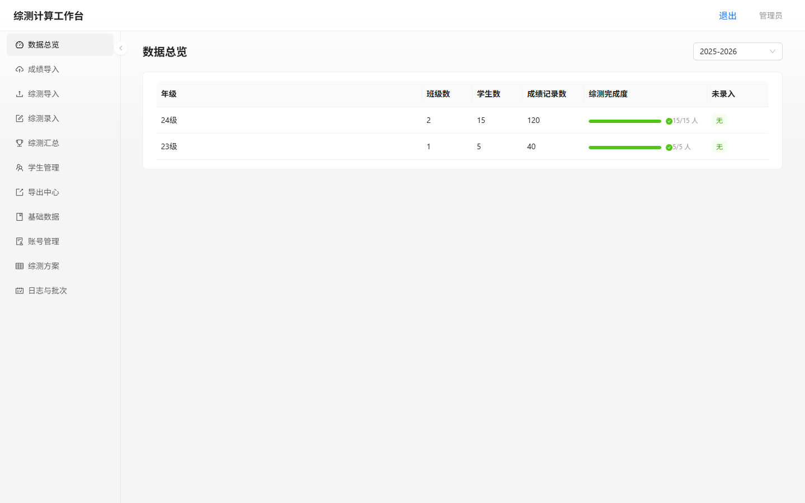
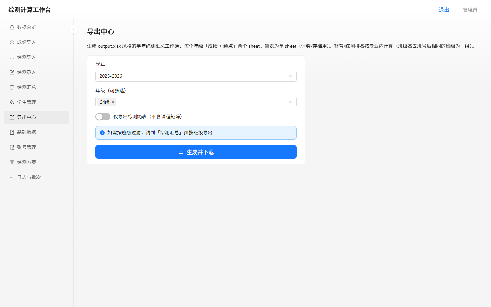
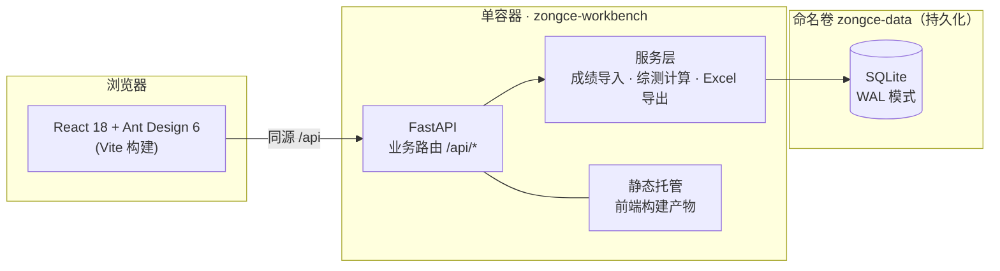

# 综测计算工作台

<p align="center">
  
</p>

<p align="center">
  <em>从手工 Excel，到一键综测汇总。</em>
</p>

<p align="center">
  <a href="https://github.com/xvkong233/zongce-workbench/actions/workflows/ci.yml"></a>
  
  
  
  
  
  
  <a href="LICENSE"></a>
</p>

---

面向高校辅导员的**学生综合素质测评（综测）平台**。把「教务成绩长表 → 二维宽表 → 班级综测明细 → 学年汇总工作簿」这条传统上全靠手工 Excel 的流水线搬到线上：成绩导入、综测录入、自动计算排名、一键导出，全流程完成。

## ✨ 功能特性

- 📥 **成绩长表一键导入** — 上传教务导出的 `1.xls/.xlsx`，自动识别学年/学期与表头；等级文本（优/良/合格…）按换算表转百分制，原始值留档；缺学号、未知等级等异常清单可导出核对，确认后才入库
- 📝 **综测在线录入 + 批量导入** — 选学年与班级，逐人录入五个项目（思想品德/社会工作/科研及科技创新/文体活动/集体建设）的加减分明细，各项小计按满分封顶；支持按年级批量导入双层表头的 `2.xlsx`
- 🏆 **自动计算与排名** — 学业加权平均 × 0.8 + 综测 × 0.2（权重可配），智育/综测排名在专业组内自动计算（班级名去班号后相同者为一组），支持重修取最新/取最高规则
- 📤 **一键导出汇总工作簿** — 还原 `output.xlsx` 风格：每年级「成绩 + 绩点」双 sheet、3–4 行规范化表头、稀疏课程矩阵、公式单元格便于核对，另有综测简表（评奖/存档用）
- 👥 **角色与权限** — 管理员 / 辅导员两级账号；辅导员绑定年级后只能访问所辖数据，可自助新建学年/年级/班级
- 🔍 **全程留痕** — 每次导入生成批次快照，支持回滚；操作日志可查
- 🐳 **单容器部署** — 多阶段构建，前端由后端同源托管；SQLite 落命名卷，升级重建不丢数据

## 📸 界面预览

| 综测录入（五项明细，封顶校验） | 综测汇总（排名一键生成） |
| --- | --- |
|  |  |

| 数据总览 | 导出中心 |
| --- | --- |
|  |  |

## 🏗️ 架构



**技术栈**：FastAPI · SQLAlchemy 2 · SQLite（WAL）· PyJWT · openpyxl/xlrd ｜ React 18 · Ant Design 6 · Vite ｜ Docker 多阶段构建

## 🚀 快速开始

```bash
git clone https://github.com/xvkong233/zongce-workbench.git
cd zongce-workbench
docker compose up -d --build
```

打开 `http://localhost:8300`，默认管理员 **`admin / admin123`**（首次登录强制改密）。

- 无需本机安装 Node/Python——前端构建与依赖安装全部在镜像内完成
- SQLite 数据存放在命名卷 `zongce-data`，删除/重建容器不丢数据
- 生产环境请通过 `.env` 设置 `ZONGCE_JWT_SECRET`，详见 [部署文档-Docker.md](部署文档-Docker.md)

<details>
<summary>⚙️ docker-compose.yml</summary>

```yaml
name: zongce

services:
  zongce:
    build: .
    image: zongce-workbench:latest
    container_name: zongce
    restart: unless-stopped
    ports:
      - "8300:8300"
    environment:
      - ZONGCE_JWT_SECRET=${ZONGCE_JWT_SECRET:-zongce-workbench-secret-change-me}
      - ZONGCE_DATA_DIR=/data
      - TZ=Asia/Shanghai
    volumes:
      - zongce-data:/data

volumes:
  zongce-data:
```

</details>

<details>
<summary>🛠️ 本地开发（不使用 Docker）</summary>

```bash
# 后端（端口 8300，数据落在 backend/../data）
cd backend
pip install -r requirements.txt
uvicorn app.main:app --host 127.0.0.1 --port 8300
python -m pytest tests/ -q        # 运行测试

# 前端（端口 5173，已配置 /api 代理到 8300）
cd frontend/app
npm install
npm run dev
```
</details>

## 📁 项目结构

```
├── backend/                 # FastAPI 后端
│   ├── app/
│   │   ├── main.py          # 装配：路由、种子数据、前端静态托管
│   │   ├── database.py      # SQLite 连接（WAL + 自动降级）
│   │   ├── models.py        # ORM 模型（学生/成绩/综测/方案/账号）
│   │   ├── auth.py          # JWT + PBKDF2 口令
│   │   ├── routers/         # 认证/成绩/综测/导出/方案/管理/总览
│   │   └── services/        # 成绩导入、综测导入、计算、Excel 导出
│   ├── tests/               # 计算规则与导入导出测试
│   └── requirements.txt
├── frontend/app/            # React 18 + Vite + Ant Design 6 前端
│   └── src/pages/           # 登录/总览/导入/录入/汇总/导出/管理
├── Dockerfile               # 多阶段构建（Node 构建 → Python 运行）
├── docker-compose.yml       # 端口、命名卷、环境变量
├── 部署文档-Docker.md        # Docker 部署与数据持久化
└── 部署文档-宝塔.md          # 宝塔面板（裸机 Python）部署
```

## 📄 文档

- [部署文档-Docker.md](部署文档-Docker.md) — 容器部署、数据备份与迁移、常见问题
- [部署文档-宝塔.md](部署文档-宝塔.md) — 宝塔面板 + Nginx 反代的传统部署
- [产品设计文档.md](产品设计文档.md) — 完整需求、业务规则与计算口径

## ⚠️ 数据隐私

本仓库**不含任何真实学生数据**。README 中的界面截图均由 [demo/make_demo_db.py](demo/make_demo_db.py)（已 gitignore）生成的虚构数据渲染。部署时请自行遵守学校的数据安全规定：数据库文件（`*.db`）与成绩 Excel 不要提交到任何代码仓库。

## License

[MIT](LICENSE)
